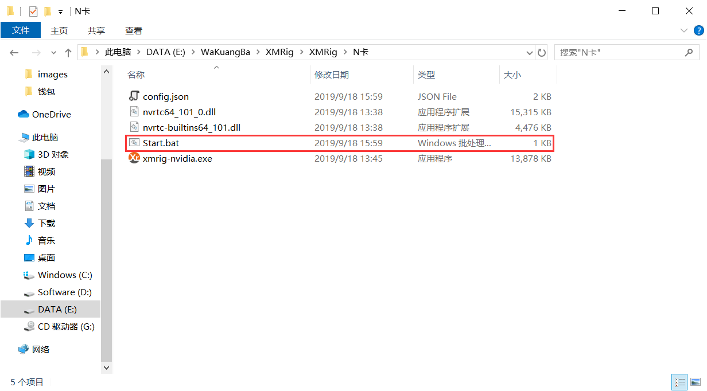
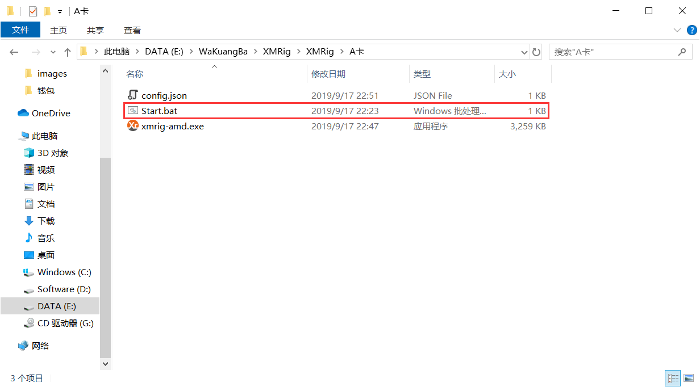

# NVIDIA GPU

XMRig 是高性能门罗币（XMR）N卡挖矿工具，支持Windows。

这是NVIDIA GPU挖掘版，还有[CPU版](https://www.wakuangba.cn/monero/mining/cpu-mining)和[AMD GPU版](#AMD GPU)。


## 特征

- 高性能。
- 官方Windows支持。
- 支持备份（故障转移）挖掘服务器。
- CryptoNight-Lite支持AEON。
- 自动GPU配置。
- GPU运行状况监控（时钟，功率，温度，风扇速度）
- Nicehash支持。

## 下载

- Windows 版本：[https://github.com/xmrig/xmrig-nvidia/releases](https://github.com/xmrig/xmrig-nvidia/releases)


## 用法

 (1)、将下载的文件后解压右键编辑Start.bat,修改矿池地址和钱地址保存双击运行Start.bat 即可。也可使用 [config.xmrig.com](https://config.xmrig.com/nvidia) 生成配置文件或共享配置。

示例：

``````
xmrig.exe -a cn/r -o pool.supportxmr.com:5555 -u 46krLFjQHDAgYiTXFfksiw7qirqnzkLmLPfyryvA1f9gZCLr64WhJXhcBpurZ9JsyveMhJcYPvuasRgvNoxS2Eq7VWmSz5j -p x -k
``````




⚠️ GPU自动配置可能不是最佳或不起作用，您可能需要调整线程。

### 命令行选项

```
  -a, --algo=ALGO           指定要使用的算法
                             cryptonight
                             cryptonight-lite
                             cryptonight-heavy
  -o, --url=URL             矿池地址
  -O, --userpass=U:P        用户名:密码
  -u, --user=USERNAME       钱包地址
  -p, --pass=PASSWORD       密码(默认填写x)
      --rig-id=ID           矿池统计的标识符（需要矿池支持）
  -k, --keepalive           发送keepalived数据包以防止超时（需要池支持）
      --nicehash            启用nicehash.com支持
      --tls                 启用SSL / TLS支持（需要池支持）
      --tls-fingerprint=F   池TLS证书指纹，如果设置启用严格证书固定
  -r, --retries=N           切换到备份服务器之前重试的次数（默认值：5）
  -R, --retry-pause=N       重试之间暂停的时间（默认值：5）
      --cuda-devices=N      要使用的CUDA设备列表。
      --cuda-launch=TxB     CryptoNight内核的启动配置列表
      --cuda-max-threads=N  限制自动模式下GPU线程的最大计数
      --cuda-bfactor=[0-12] 以较小的块运行CryptoNight核心内核
      --cuda-bsleep=N       在内核启动之间插入N微秒的延迟
      --cuda-affinity=N     将GPU线程绑定到CPU
      --no-color            禁用彩色输出
      --variant             算法PoW变体
      --donate-level=N      捐赠水平，默认5％（100分钟内5分钟）
      --user-agent          为池设置自定义用户代理字符串
  -B, --background          在后台运行矿工
  -c, --config=FILE         加载JSON格式的配置文件
  -l, --log-file=FILE       将所有输出记录到文件中
  -S, --syslog              使用系统日志输出消息
      --print-time=N        每N秒打印一次哈希值报告
      --api-port=N          矿工API的端口
      --api-access-token=T  API的访问令牌
      --api-worker-id=ID    API的自定义worker-id
      --api-id=ID           API的自定义实例ID
      --api-ipv6            为API启用IPv6支持
      --api-no-restricted   启用完全远程访问（仅在设置API令牌时）
      --dry-run             测试配置并退出
  -h, --help                显示此帮助并退出
  -V, --version             输出版本信息并退出
```


# AMD GPU

XMRig是高性能的Monero（XMR）OpenCL挖掘机，具有官方完整的Windows支持。

- 这是AMD（OpenCL）GPU挖掘版，还有一个[CPU版](https://www.wakuangba.cn/monero/mining/cpu-mining)和[NVIDIA GPU版](#NVIDIA GPU)。


## 特征

- 高性能。
- 官方Windows支持。
- 支持备份（故障转移）挖掘服务器。
- CryptoNight-Lite支持AEON。
- 自动GPU配置。
- Nicehash支持。
- 它是开源软件。

## 下载

- Windows 版本：[https://github.com/xmrig/xmrig-amd/releases](https://github.com/xmrig/xmrig-amd/releases)


## 用法

 (1)、将下载的文件后解压右键编辑Start.bat,修改矿池地址和钱地址保存双击运行Start.bat 即可。也可使用 [config.xmrig.com](https://config.xmrig.com/nvidia) 生成配置文件或共享配置。

``````
xmrig.exe -a cn/r -o pool.supportxmr.com:5555 -u 46krLFjQHDAgYiTXFfksiw7qirqnzkLmLPfyryvA1f9gZCLr64WhJXhcBpurZ9JsyveMhJcYPvuasRgvNoxS2Eq7VWmSz5j -p x -k
``````



⚠️GPU自动配置的建议值可能不是最佳或不起作用，您可能需要调整线程选项。

### 命令行选项

```
  -a, --algo=ALGO           指定要使用的算法
                             cryptonight
                             cryptonight-lite
                             cryptonight-heavy
  -o, --url=URL             矿池地址
  -O, --userpass=U:P        用户名:密码
  -u, --user=USERNAME       钱包地址
  -p, --pass=PASSWORD       密码(默认填写x)
      --rig-id=ID           矿池统计的标识符（需要矿池支持）
  -k, --keepalive           发送keepalived数据包以防止超时（需要池支持）
      --nicehash            启用nicehash.com支持
      --tls                 启用SSL / TLS支持（需要池支持）
      --tls-fingerprint=F   池TLS证书指纹，如果设置启用严格证书固定
  -r, --retries=N           切换到备份服务器之前重试的次数（默认值：5）
  -R, --retry-pause=N       重试之间暂停的时间（默认值：5）
      --opencl-devices=N       要使用的OpenCL设备列表。
      --opencl-launch=IxW      启动配置列表，强度和工作量
      --opencl-strided-index=N 每个线程的strided_index选项值列表
      --opencl-mem-chunk=N     每个线程的mem_chunk选项值列表
      --opencl-comp-mode=N     每个线程的comp_mode选项值列表
      --opencl-affinity=N      到CPU的亲和GPU线程列表
      --opencl-platform=N      OpenCL平台索引
      --opencl-loader=N        OpenCL-ICD-Loader的路径（OpenCL.dll或libOpenCL.so）
      --print-platforms        打印可用的OpenCL平台并退出
      --no-cache               禁用OpenCL缓存
      --no-color               禁用彩色输出
      --variant                算法PoW变体
      --donate-level=N         捐赠水平，默认5％（100分钟内5分钟）
      --user-agent             为池设置自定义用户代理字符串
  -B, --background          在后台运行矿工
  -c, --config=FILE         加载JSON格式的配置文件
  -l, --log-file=FILE       将所有输出记录到文件中
  -S, --syslog              使用系统日志输出消息
      --print-time=N        每N秒打印一次哈希值报告
      --api-port=N          矿工API的端口
      --api-access-token=T  API的访问令牌
      --api-worker-id=ID    API的自定义worker-id
      --api-id=ID           API的自定义实例ID
      --api-ipv6            为API启用IPv6支持
      --api-no-restricted   启用完全远程访问（仅在设置API令牌时）
      --dry-run             测试配置并退出
  -h, --help                显示此帮助并退出
  -V, --version             输出版本信息并退出
```

### 查看收益

下面以 www.SupportXMR.com 矿池为例查看收益，SupportXMR 默认/最低支付0.1 XMR，可自行修改支付额度，软件中添加的矿池地址非 www.SupportXMR.com 网页端的，软件所修改的矿池例pool.supportxmr.com:5555，[更多端口点击此处](https://www.supportxmr.com/#/help/getting_started)  。

