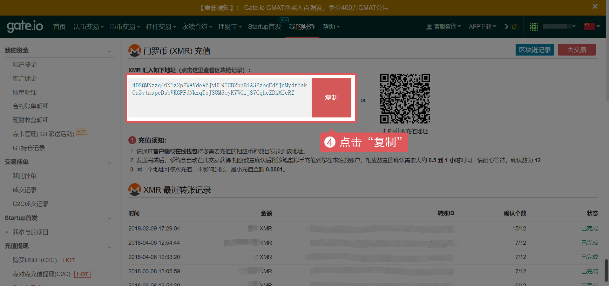
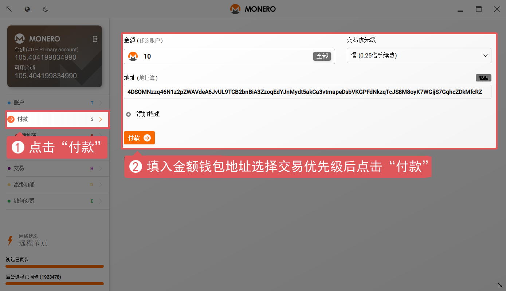

##### 1、充值地址打开方式

（1）登录gate.io账户 — 访问菜单栏“币币交易” — 选择充值币种-点击充值按钮。

（2）登录账户 — 访问菜单栏“我的财务”，链接[https://gateio.io/myaccount](https://gateio.io/myaccount)，在资金里面查找到要充值的币种，点击充值按钮。

（3）登录账户，在首页，个人信息那里有“充值”。

##### 2、点击找到要充值的币种

##### 3、查询您在gate.io的充值地址，复制充值地址

##### 4、打开门罗币钱包转账

***⚠️ 注意：将刚才复制的地址粘贴到地址处，交易优先级选择越高到账速度越快相对应手续费越高。请将钱包同步完成后再点击第二个付款按钮。***

##### 5、转币完成后，可以在“最近充值记录”上查看

##### 6、根据充值记录上的转账ID在对应的区块记录查询是否发送成功。等待区块确认，发送成功并且确认数足够会自动到账

***⚠️注意：务必根据提示选择正确的充值地址，如果转错地址，将无法找回！***