
1、下载钱包

钱包下载地址：[https://getmonero.org/downloads](https://getmonero.org/downloads)  （如果下载缓慢请使用下载工具下载）

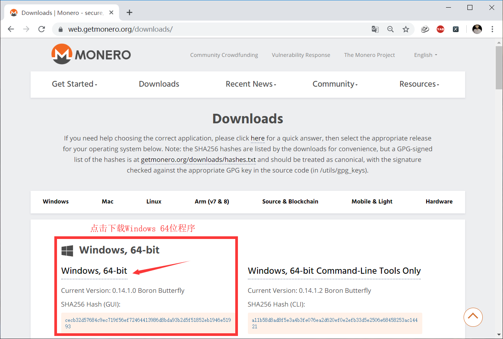

2、图形界面钱包生成

解压运行monero-wallet-gui.exe，一步步跟着操作就好了，就不在描述了。

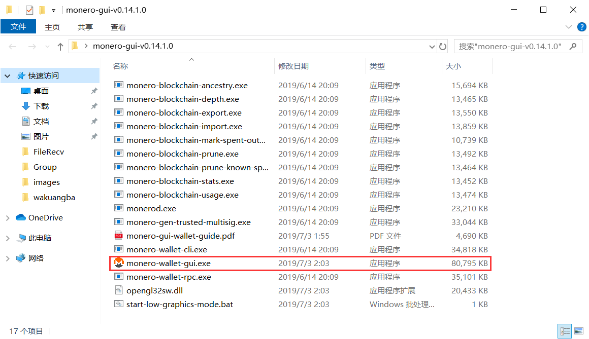

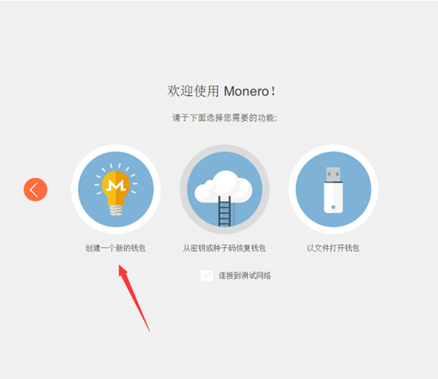

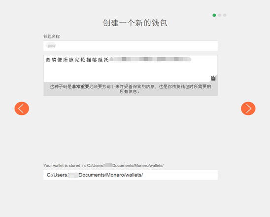

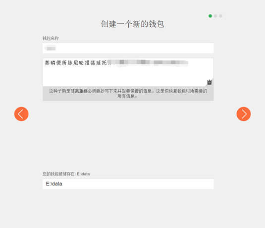

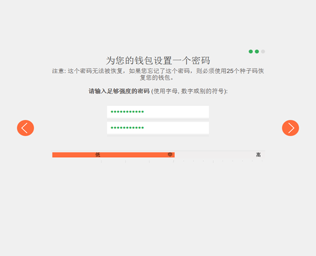

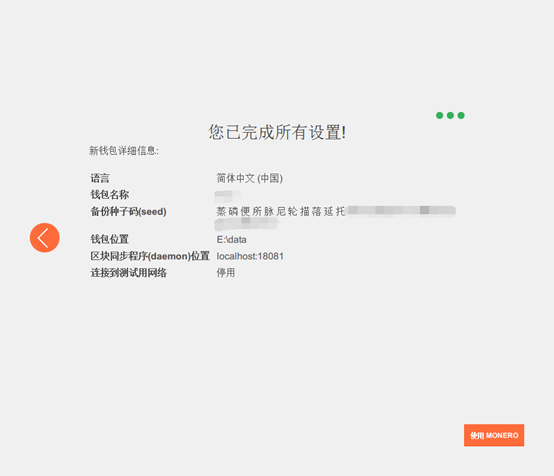

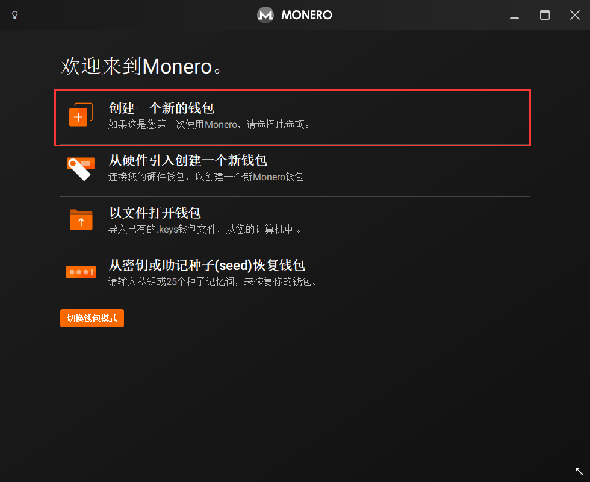

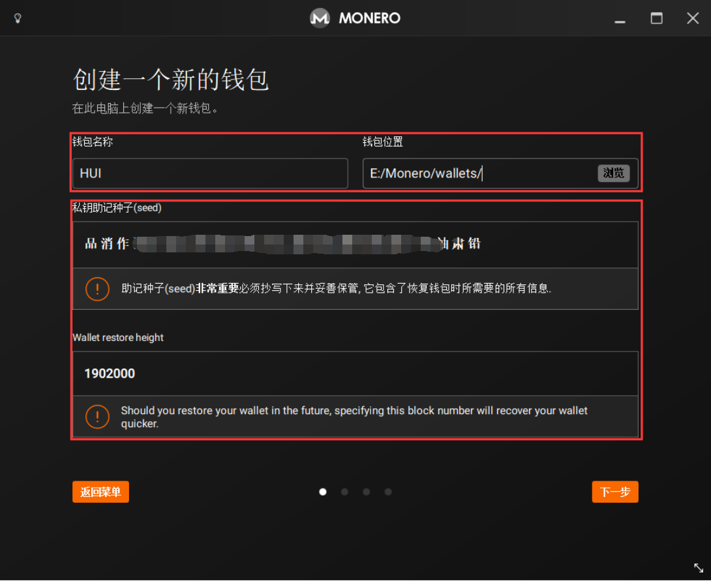

重要提醒:

（1）该信息请妥善保管，以防钱包被盗，如钱包丢失用该信息恢复钱包。

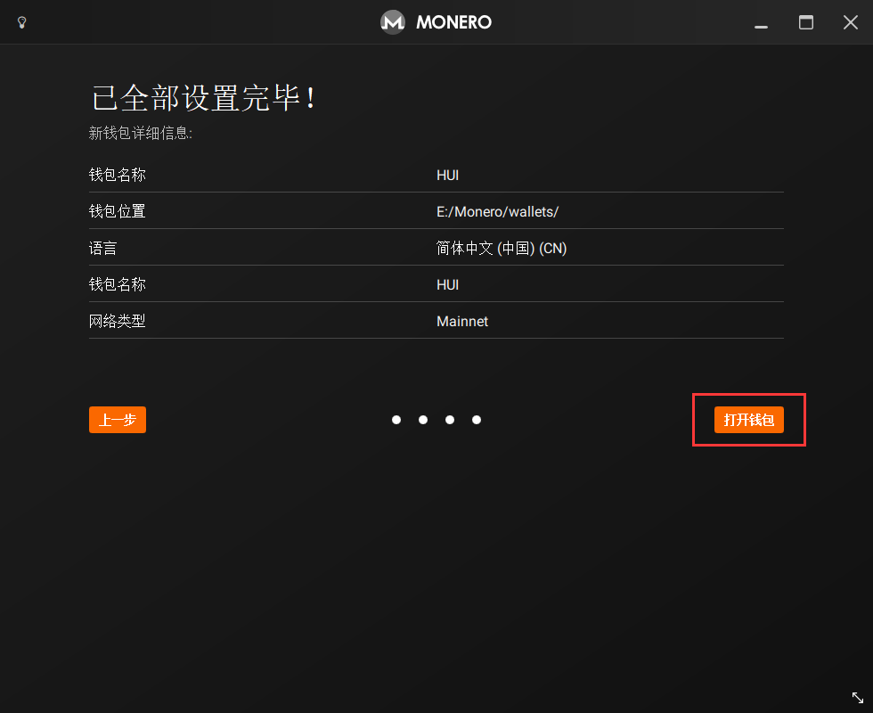

（2）需要同步完区块才能进行查看实时余额及转账，但不影响挖矿，挖矿可直接使用钱包地址挖。

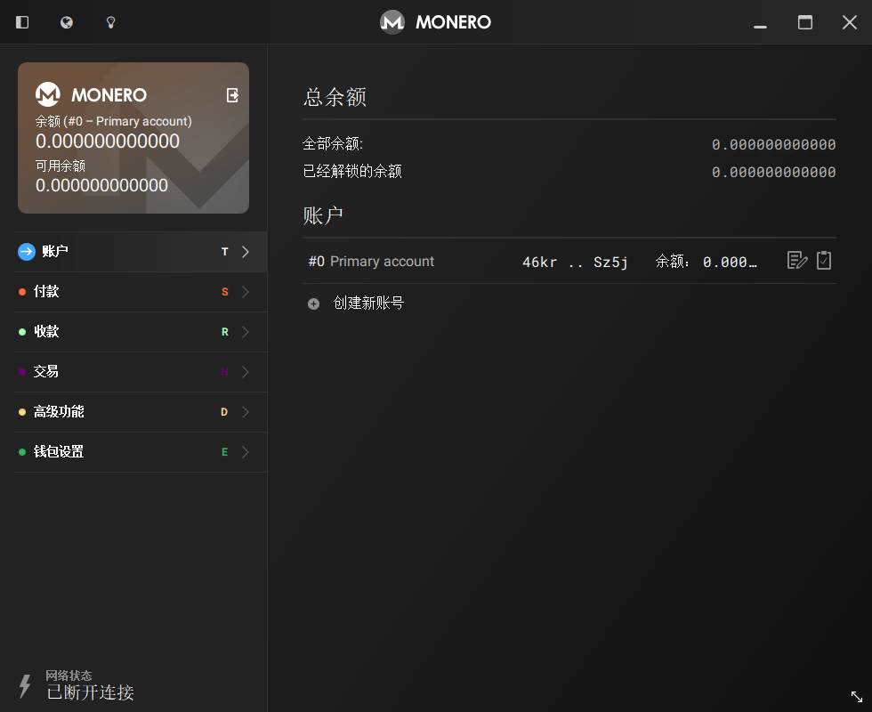

（3）区块同步数据默认存放在C盘，根据下图可自行修改：

默认存放目录 C:\ProgramData\bitmonero，如已同步部分数据，可将该文件夹移到其他盘修改路径。

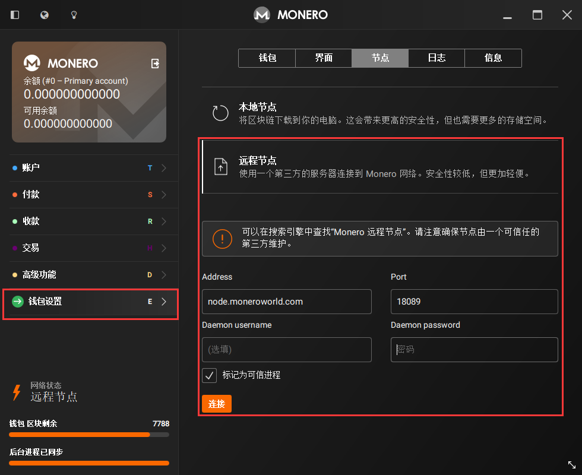

图形界面操作较为简单，推荐使用图形界面，如没特殊要求请自行略过以下内容。

3、命令行钱包生成

解压运行monerod.exe和monero-wallet-cli.exe，monerod.exe是守护进程用于同步区块，monero-wallet-cli.exe钱包主程序。

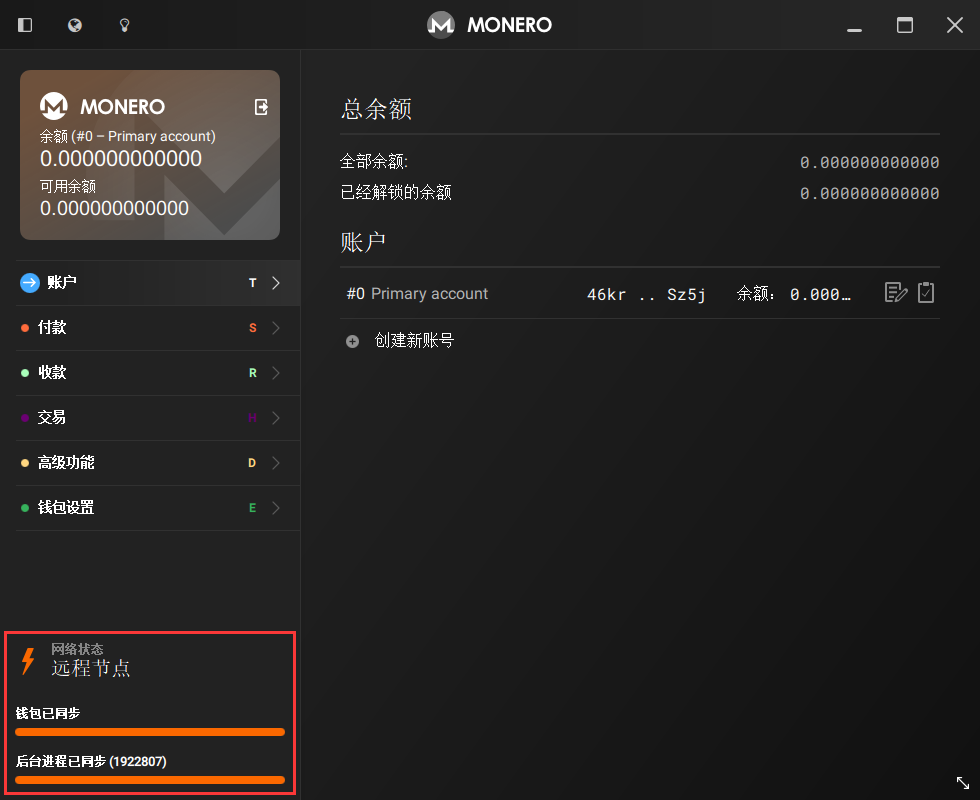

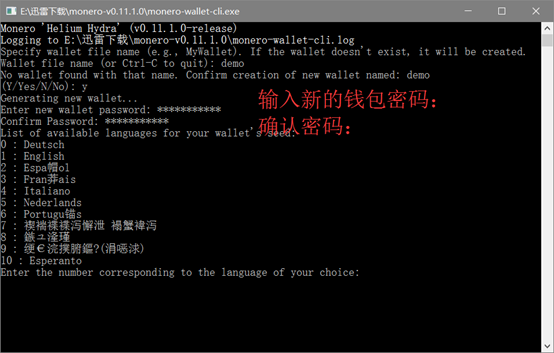

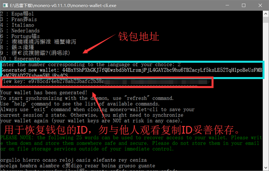

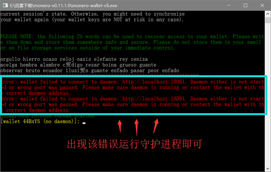

转账命令

transfer 0 [Base Addresss] [amount] [Payment_Id]

其他命令

help 帮助                  balance 查看钱包数据

refresh 更新钱包              save 保存

重要提醒：

（1）需要同步完区块才能进行查看实时余额及转账，但不影响挖矿，挖矿可直接使用钱包地址挖。

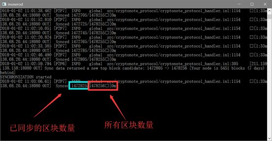

（2）区块同步数据默认存放在C盘。

monerod.exe –data-dir E:\bitmonero 将以上命令保存为bat批处理文件 里面的E:\bitmonero 为你想同步的目录名称.然后将批处理文件放

在和你钱包文件同一个目录下就行了。这样每次运行批处理文件就会默认同步在你设定的同步目录了。

温馨提示：如果你以前默认同步在C盘下了。最好同步完成在将同步好的整个文件夹复制到你想保存的盘符目录。然后在同步。这样以免更改同步

路径还得重新进行同步。

